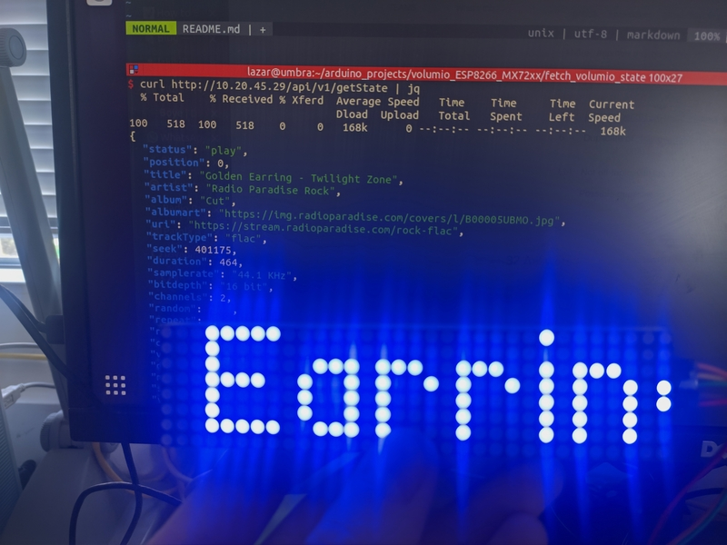

# Volumio fetch and display

I've recently bought RPI and installed volumio on it. Its "audiophile music player", basically glorified music player with some really cool features (bunch of USB DACs support!).

So, they have web interface, and that is cool. But i wanted to actually see song/artists/service (webradio or spotify) service that im currently using. So i got some spare parts (nodeMCU, and 8x8x4 LED displays driven by MAX7219) and used examples to fetch api/v1/getState object from volumio and show it on display. (still WIP)

